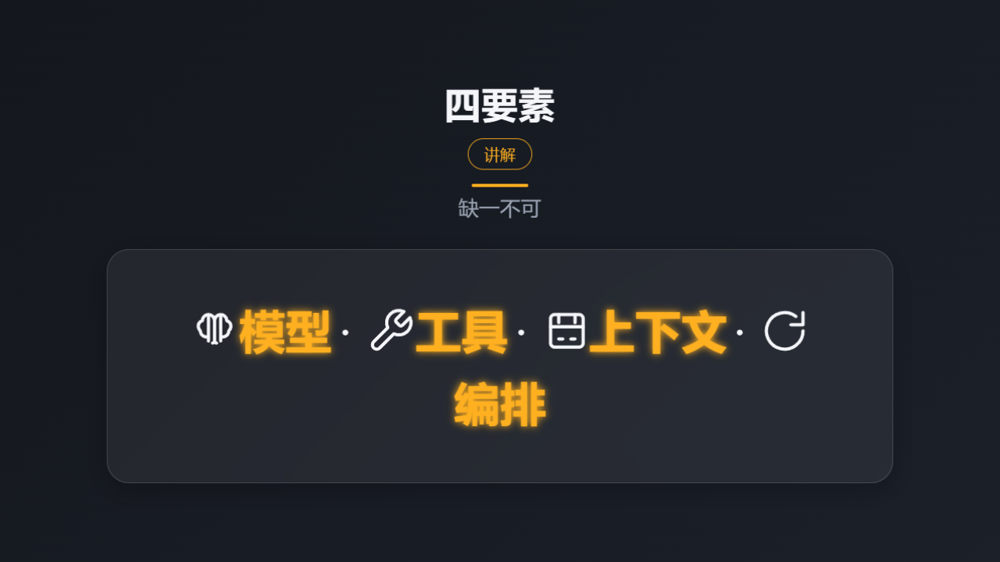

# micro-course

> 原名 `eggram`（english grammar 的缩写），从英语语法起步，已扩展到任意适合讲练穿插的知识点。仓库目录沿用 `eggram/` 以保留 git 历史与远程地址。

教学微课：把一个知识点做成 2–3 分钟的 mp4 短视频。英语语法、数学公式、物理定律、语文修辞——任何适合「讲练穿插、一页一概念」的知识点都可以。

面向中小学的教学微课生成器，讲练穿插、一页一概念。**内容先行**——先用「分镜」（storyboard JSON）定内容，再过「闸门」校验，最后渲染成片；两阶段可独立跑。

## 特性

- **分镜驱动**：一页一个动作，`**...**` 标出知识点；字段见 [docs/json-schema.md](docs/json-schema.md)
- **教学弧（page-role）**：`title → rule+ → example+ → practice → answer → summary` 必选弧；推荐在 `practice` 前加 `mistake`，先讲后练再揭晓
- **闸门校验**：教学弧顺序 + `practice.hold >= 3.0` 硬门槛，渲染前必过
- **换皮**：teaching / classroom / explainer 三套皮肤，只改 style，不动内容与版式
- **音画锁**：音轨时长与画面帧对齐，hold 段静音；音频按课目录 + 旁白/音色指纹缓存，防串课
- **克制动效**：focus / pulse / zoom，把眼睛送到高亮与结论
- **inline 图标**：body 支持 `[name]**词**` token，inline SVG 自动嵌入高亮 span，跟 pulse 同步缩放/发光

## 展示



↑ 1 页浓缩展示：分镜结构 + 教学弧 + pulse 动效 + inline 图标系统。

仓库包含 3 个分镜 demo，覆盖三类内容场景：

| 示例 | 学科 / 场景 | 一句话 |
| --- | --- | --- |
| [examples/now_progressing.json](examples/now_progressing.json) | 英语语法 | 现在进行时讲解（首支 demo） |
| [examples/rational_actor.json](examples/rational_actor.json) | 经管社科 | 理性经济人 |
| [examples/what_is_harness.json](examples/what_is_harness.json) | 概念讲解 | 什么是 Harness（4 个组件各配 inline 图标） |

## 快速开始

### 环境要求

- Python 3.11+（依赖 playwright、imageio_ffmpeg、numpy）；Windows 用 `py` 启动器（`python` 在 WindowsApps 桩上静默 exit 49、零输出），macOS/Linux 用 `python3`
- 本机 Chrome / Edge（自动发现；也可用 `--browser <路径>` 或环境变量 `BROWSER_PATH`/`CHROME_PATH` 显式指定）
- 环境变量 `MIMO_API_KEY`（可选 `MIMO_API_URL`），用于 TTS 配音

### 写分镜

分镜是教学内容本体（JSON），示例见上方「展示」段表格。写完后先过闸门（任选一个 demo 验证）：

```bash
py scripts/validate_storyboard.py examples/now_progressing.json
# 或：examples/rational_actor.json / examples/what_is_harness.json
```

退出码 0 表示通过。

### 渲视频

```bash
py scripts/make_video.py examples/now_progressing.json [output/name.mp4] [--style NAME] [--reuse-audio] [--no-motion] [--preview] [--browser PATH]
```

- 默认输出 `output/<分镜主名>.mp4`
- `--style` 覆盖换皮
- `--reuse-audio` 复用已生成的旁白（指纹命中才复用，详见 [docs/audio.md](docs/audio.md)）
- `--preview` 只出缩略图与溢出报告，不调 TTS / ffmpeg
- `--browser` 显式指定浏览器可执行文件（Chrome / Edge），否则自动发现
- 参数严格解析：未知参数、多余位置参数、缺失选项值会在任何流水线步骤前报错退出

建议先跑一次 `--preview` 确认没有文字溢出，再全量渲染。

## 文档

| 文档 | 内容 |
| --- | --- |
| [SKILL.md](SKILL.md) | Agent 入口，两阶段完整流程 |
| [docs/teaching-method.md](docs/teaching-method.md) | page-role 教学弧 |
| [docs/json-schema.md](docs/json-schema.md) | 分镜字段表与 `**` 高亮约定 |
| [docs/styles.md](docs/styles.md) | 换皮 |
| [docs/motion.md](docs/motion.md) | 动效 |
| [docs/audio.md](docs/audio.md) | 音画锁与音频缓存 |
| [docs/agents/issue-tracker.md](docs/agents/issue-tracker.md) | 本地 issue 规范 |

## 目录结构

```
eggram/
├── SKILL.md                     # Agent 入口（micro-video）
├── AGENTS.md                    # Agent 上下文指针
├── examples/                    # 分镜样例（3 个 demo：语法 / 经管 / 概念讲解）
├── scripts/
│   ├── make_video.py            # 渲染管线：预览 → TTS → 截帧 → ffmpeg
│   └── validate_storyboard.py   # 闸门校验
├── tests/                       # 回归测试（test_make_video.py，pytest）
├── templates/
│   ├── layout-*.html            # 每种 kind 的版式槽
│   └── style-*.json             # 皮肤（视觉 token）
├── docs/                        # 教学法 / 字段 / 换皮 / 动效 / 音画锁
├── archive/                     # 历史成片
├── output/                      # 成片输出（gitignore）
└── _build/                      # 中间产物（gitignore）
```

## 设计契约

- 分镜只承载教学内容；style 只承载视觉 token；layout 只承载结构槽与居中构图
- 渲染前必过闸门；改分镜或模板后先校验，再全量配音

## 许可证

私人仓库，暂未开源。
